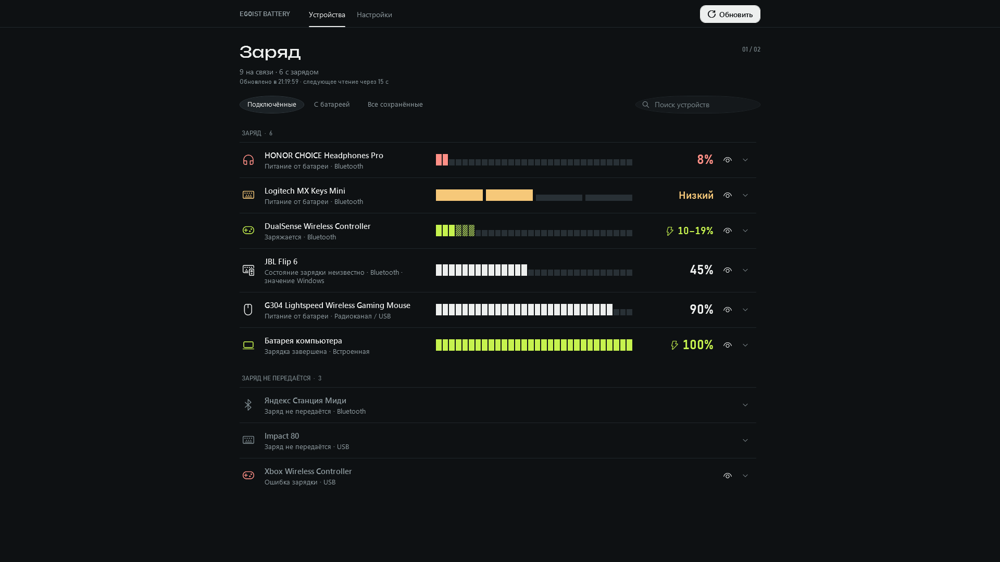

# Egoist Battery

Локальный монитор заряда подключённых устройств для Windows. [Скачать последний выпуск](https://github.com/egoist-ai1/egoist-battery/releases/latest).

[](https://github.com/egoist-ai1/egoist-battery/actions/workflows/build.yml)



Для каждого подключённого устройства с доступными данными создаётся отдельный значок в системном трее; при наведении курсора появляется панель со всеми подключёнными устройствами. Отключённые устройства можно посмотреть в окне приложения среди сохранённых. Интерфейс на русском языке. Экономный режим включён по умолчанию: фоновый монитор остаётся в трее, а окно работает в отдельном процессе.

Приложение читает DualSense и DualShock 4 по USB и Bluetooth HID без принудительного переключения Bluetooth в full-mode; Logitech HID++ 2 через GET1004/1000; кэш заряда HFP из Windows PnP; BLE Battery Service 180F и характеристику 2A19 только у уже подключённых устройств; XInput и батарею компьютера. Для Logitech в HID output отправляются только документированные GET-запросы; команды изменения настроек не отправляются. BLE-обнаружение не подключает устройства.

Показания сохраняют точность источника. DualSense сообщает заряд ступенями по 10%, поэтому показывается честный интервал, а не вымышленный точный процент. Для кэшированного значения Windows показываются источник и время, если они известны. Доступность данных зависит от модели и подключения.

## Установка

Установщик `EgoistBattery-1.0.0-Setup-x64.exe` предназначен для Windows 10 x64, сборка 19041 или новее, и Windows 11 x64. Он устанавливает приложение только для текущего пользователя в `%LOCALAPPDATA%\Programs\EgoistBattery`, не требует прав администратора или отдельной установки .NET, создаёт ярлык и добавляет приложение в автозапуск. Пользовательские данные хранятся в `%LOCALAPPDATA%\EgoistBattery`.

Удаление регистрируется в стандартном списке приложений Windows. При удалении пользовательские настройки сохраняются. Установщик не обновляет приложение автоматически: скачайте новый установщик со страницы выпусков. Файлы выпуска не подписаны; Windows SmartScreen может показать предупреждение.

Архив `EgoistBattery-1.0.0-Portable-x64.zip` содержит автономный `EgoistBattery.exe`; распакуйте архив и запустите EXE с параметром `--tray`, чтобы оставить монитор в системном трее.

Установщик `scripts/Install.ps1` — прежний локальный сценарий и сохраняет резервные копии настроек автозапуска. Для обычной установки пользователям рекомендуется Setup из выпуска. Отдельный необязательный сценарий владельца `scripts/DualSenseAudio.ps1` меняет настройки аудио DualSense только при ручном запуске; установщик Egoist Battery не меняет драйверы или аудиоустройства.

## Сборка из исходников

Требуется .NET SDK 8.0.425, заданный в `global.json`. Runtime 8.0.31 закреплён в настройках сборки; пакеты NuGet восстанавливаются в locked-mode.

```powershell
pwsh -NoProfile -File ./build.ps1
```

Сценарий собирает приложение, запускает 87 проверок, публикует одиночный EXE и готовит установщик, portable-архив и `SHA256SUMS.txt` в `artifacts/1.0.0`. Для сборки EXE и архива без установщика используйте `-SkipInstaller`. Сборка установщика требует NSIS 3.13. Если NSIS отсутствует, сценарий загружает переносимый набор инструментов с SHA256, закреплённым в `packaging/toolchain.json`; установка в систему не требуется.

Изолированная проверка установщика:

```powershell
pwsh -NoProfile -File ./scripts/Test-Installer.ps1 -Installer ./artifacts/1.0.0/EgoistBattery-1.0.0-Setup-x64.exe
```

## Работа приложения

По умолчанию фоновый опрос выполняется не чаще одного раза в 60 секунд, а при открытом окне — каждые 15 секунд. События USB/Bluetooth объединяются задержкой 800 мс перед дополнительным опросом. Окно работает в отдельном процессе того же EXE с параметром `--window`; оно читает снимок фонового процесса и само не опрашивает HID или GATT.

Устройство за радиоприёмником, которое не сообщает отдельное событие отключения, исчезает из трея при следующем опросе. По умолчанию интервал фонового опроса — 60 секунд; чтение источников занимает дополнительное время.

Параметры опубликованного EXE:

```text
EgoistBattery.exe --probe --data-dir <папка> --output <json>
EgoistBattery.exe --ui-test --data-dir <папка>
EgoistBattery.exe --tray
EgoistBattery.exe --exit
```

## Документация

- [Архитектура](docs/ARCHITECTURE.md)
- [Продукт и решения](docs/PRODUCT.md)
- [Дизайн интерфейса](docs/DESIGN.md)
- [Сборка и выпуск](docs/RELEASE.md)
- [Участие в разработке](CONTRIBUTING.md)
- [Лицензия MIT](LICENSE)
