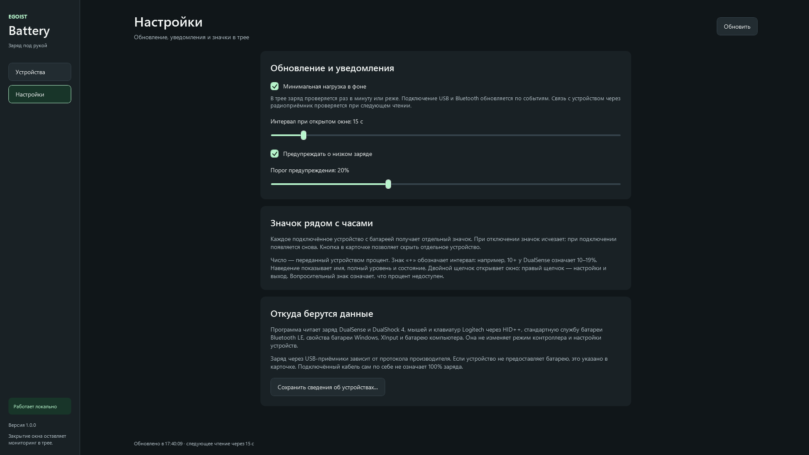
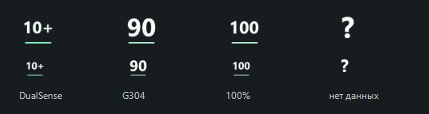

# Проверка первого выпуска

Дата: 2026-10-08. Windows x64, .NET SDK 8.0.425, runtime 8.0.31.

- 70 проверок Core: корректные/повреждённые отчёты Sony и HID++, CRC Bluetooth,
  интервалы точности, объединение устройств и выбор значков трея.
- Публикация самостоятельного EXE без предупреждений компилятора.
- Проверки PowerShell (PSScriptAnalyzer) и workflow (actionlint 1.7.12)
  без ошибок и предупреждений; дополнительные ShellCheck/Pyflakes не использовались.
- Изолированная установка → запуск опубликованного EXE → удаление.
  Папка установки содержит кириллицу, пробелы и квадратные скобки.
  Посторонний файл, действующий монитор и автозапуск сохранены.
- WPF self-test: устройства, настройки, поиск, пустое состояние, ползунок,
  создание/удаление отдельных NotifyIcon и компоновка Full HD при масштабах
  100%, 125%, 150%, 200%. Это программные рендеры, не проверка четырёх физических мониторов.

Аппаратные наблюдения: G304 возвращал 90% через HID++ GET; DualSense был прочитан
по USB и Bluetooth в разные моменты с сохранением интервала точности устройства.
Это подтверждение источников на конкретных устройствах, не универсальная гарантия.

Замер фонового монитора после закрытия отдельного процесса окна:
140 секунд, интервал проверки 120 секунд, 16 логических процессоров.
Общий CPU около 0,005%; приватная резидентная память 17–20 MiB,
полный рабочий набор с библиотеками около 100–103 MiB. Драйвер GPU
в фоновом процессе не загружен. Результат зависит от устройств и настроек;
длительный нагрузочный прогон и полный цикл сна/возобновления не проведены.

